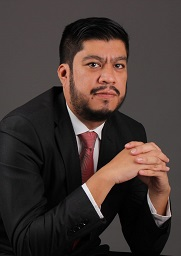

# JOSE LUIS TELLO GUZMAN
Mobile: +51 989269456 / Email: jose.luis.tello@gmail.com / National Identity Card: 41590081 / https://www.linkedin.com/in/jose-luis-tello-guzman/

 
### Solution Architect | Systems Engineer | MBA, PMP®, TOGAF® 9 Foundation, BIAN Banking Architecture Foundation, PSM™, Microsoft Certified
Jose has 18+ years of professional experience in Information Technology (IT), in specialties such as enterprise architecture, project management, software development and others.

He is currently a **Solutions Architect at BCP**, the leading bank in the Peruvian financial market and one of the largest bank in Latin America, that is a part of the financial holding Credicorp (NSY: BAP)

Jose holds an **MBA from the ESAN University** and many international certifications as:
- BIAN Banking Architecture Foundation, issued by Van Haren
- TOGAF® 9 Foundation, issued by The Open Group
- Project Management Professional (PMP) ®, issued by the Project Management Institute (PMI) ®
- Professional Scrum Master (PSM) ™ issued by Scrum.org ™
- Microsoft Certified: Azure Fundamentals issued by Microsoft®
- Microsoft Certified: Azure Data Fundamentals issued by Microsoft®
- Linux Professional Institute: Linux Essentials 

---
### PROFESSIONAL EXPERIENCE
#### Banco de Credito del Peru (BCP) - Location: Lima, Peru
- **July 2017 – Present (5.5 years) / Solution Architect** 
Define "how" the technological architecture components ensure the development and achievement of the strategic and technological  company vision, in order to reduce development costs, improve time to market, reduce technological complexity and have optimal levels of stability and performance. 

- **June 2013 – June 2017 (4 years) / Senior System Analyst** 
Ensure assigned applications operational stability, define business solutions technical scope, monitor and control applications changes, solve technical problems on production environments, provider technical management and others. 

- **July 2011 – May 2013 (2 years) / System Analyst** 
Applications functional and technical designs related to business needs, providing guidelines aligned with the methodology, metrics and defined company standards. 

#### Banco de Credito del Peru (BCP) - Location: Arequipa, Peru
- **May 2005 – June 2011 (6 years, 2 months) / Software Engineer** 
Full stack developer of in-house or third party applications, complying the IT architecture company guidelines and standards and project time, quality and budget objectives. 

#### Universidad Privada del Norte - Location: Lima, Peru
- **August 2018 – July 2019 (1 year) / Professor part time** 
Courses: Software architecture and design; AI Systems; Mobile apps; Video games

---
### EDUCATION  
#### ESAN - Location: Lima, Peru
- August 2013 – August 2015 / Master of Business Administration (MBA)

#### Universidad Nacional Jorge Basadre Grohmann - Location: Tacna, Peru
-	March 2010 / Computer Systems Engineer
- April 1999 - December 2003 / Bachelor of Science with a major in Computer Systems

---
### CERTIFICATIONS
- BIAN Banking Architecture Foundation/ September 2022
- Linux Professional Institute: Linux Essentials / April 2021
- Microsoft Certified: Azure Data Fundamentals issued by Microsoft® / February 2021
- TOGAF® 9 Foundation, issued by The Open Group / March 2020
- Microsoft Certified: Azure Fundamentals issued by Microsoft® / February 2020
- Perú Engineers College - Lima Departmental Council  - ID 220391 / November 2018
- Professional Scrum Master (PSM) ™ issued by Scrum.org ™ / July 2018
- Project Management Professional (PMP) ®, issued by the Project Management Institute (PMI) ®  License 1821657/ June 2015

---
### COMPLEMENTARY EDUCATION
- EGADE Business School - TEC de Monterrey -  International Week - Location: Guadalajara, Mexico / May 2015
- UPC Graduate School - Project Management Diploma,  Location: Arequipa, Peru / June 2008 - October 2008

---
### EDUCATION DISTINCTIONS
- First in his Class - Jorge Basadre Grohmann National University - Location Tacna, Peru / December 2003

---
### LANGUAGES
- Spanish: Native Language
- English: CEFR LEVEL B1  (Reading 161, Listening 170, Writing 153, Speaking 151)
